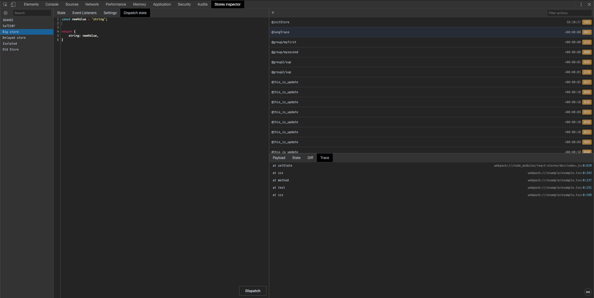

# React Stores Devtools Extension

<p align="center">
  
</p>

Debug your react stores with chrome devtools extension.

- 🔍 Inspect stores current state
- 📜 Check store history step-by-step
- 🔬 Compare diff between states
- 📨 Dispatch state directly from devtools
- 🍔 Clickable stack trace for history and listeners
- 🚀 Use in production build
- 📦 Works with isolated stores
- 🎨 Familiar native chrome themes


## How to install

- from [Chrome Web Store](https://chrome.google.com/webstore/detail/react-stores-devtools-extension/jofikieipejiceaccabdhlbedbfhogkm);
- or build it with `yarn && yarn run build` and [load the extension's folder](https://developer.chrome.com/extensions/getstarted#unpacked) `./extension`;

## Demo

See how the extension works on [Online demo](https://ibitcy.github.io/react-stores/)

## Usage

You don't have to do anything if you use react-stores@5.\* or higher

### For old versions

> **Note**: Some functions may now work

Start follow you stores with function

```js
const storeOptions = {
  persistence: true
};

const oldStore = new Store4(
  {
    test: "name",
    dateField: Date.now()
  },
  storeOptions
);

window["__REACT_STORES_INSPECTOR__"].attachStore(
  oldStore,
  "Old Store",
  storeOptions
);
```


